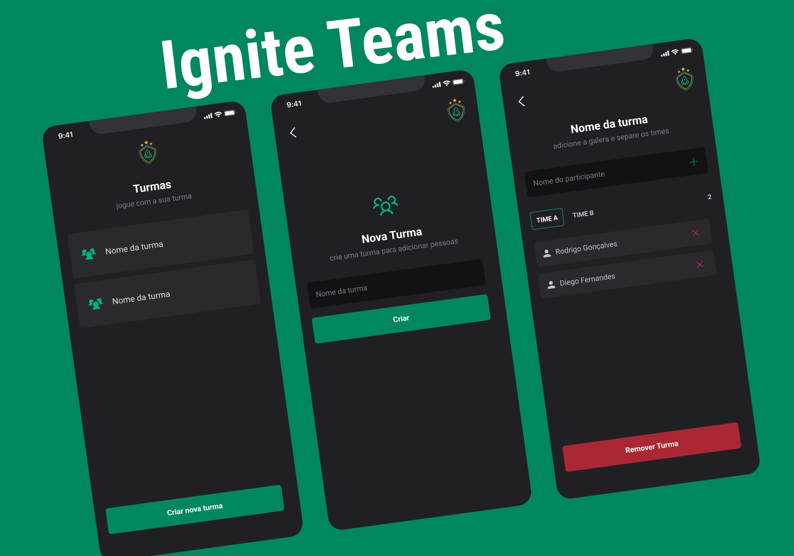

___
### Desing do Projeto - Figma

[Figma - Ignite Teams](https://www.figma.com/community/file/1151864427495057381)
___
## Descrição

O Ignite Teams é um projeto desenvolvido como parte do curso de React Native pela Rocketseat. Ele oferece uma aplicativo para gerenciar grupos e equipes, permitindo a criação de grupos, adição e remoção de integrantes, bem como a organização desses integrantes em times dentro dos grupos. Aqui está uma visão geral das funcionalidades e das tecnologias utilizadas neste projeto.


## Funcionalidades 🛠️

- Criar um grupo
- Adicionar integrantes a um grupo
- Adicionar integrantes a um time dentro de um grupo
- Remover um integrante de um time dentro de um grupo
- Remover um grupo

## Tecnologias Utilizadas 💻

- React Native
- Type Script
- Expo 
- Styled-components
- babel-plugin-module-resolver
- Library Icons Phosphor-react-native
- Expo react-navigation
- React native safe area contex
- Prop Drilling
- Async Storage
## Como Usar 🚀

### Pré-requisitos ✅

- Node.js
- npm ou yarn
- Expo CLI

### Instalação 📦

1. Clone o repositório:

```
git clone https://github.com/anjosmarcos/ignitetems.git

```

2. Navegue até o diretório do projeto:

```
cd ignitetems
```

3. Instale as dependências:

```
npm install 
```

ou

```
yarn install
```

### Execução ▶️

Para executar o projeto em seu ambiente de desenvolvimento local, você pode usar o seguinte comando:

```
npm start
```

ou

```
yarn start
```

Isso iniciará o servidor de desenvolvimento Expo.


## Contribuição 🤝

Contribuições são bem-vindas! Se você quiser contribuir com melhorias, novas funcionalidades ou correções de bugs, sinta-se à vontade para abrir uma issue ou enviar um pull request.

## Licença 📝

Este projeto é licenciado sob a [Licença MIT](https://opensource.org/licenses/MIT).

---

Esse README.md fornece uma visão geral do projeto, explica como instalar e usar, e fornece informações sobre como contribuir e a licença do projeto. Certifique-se de personalizá-lo conforme necessário para o seu projeto específico.